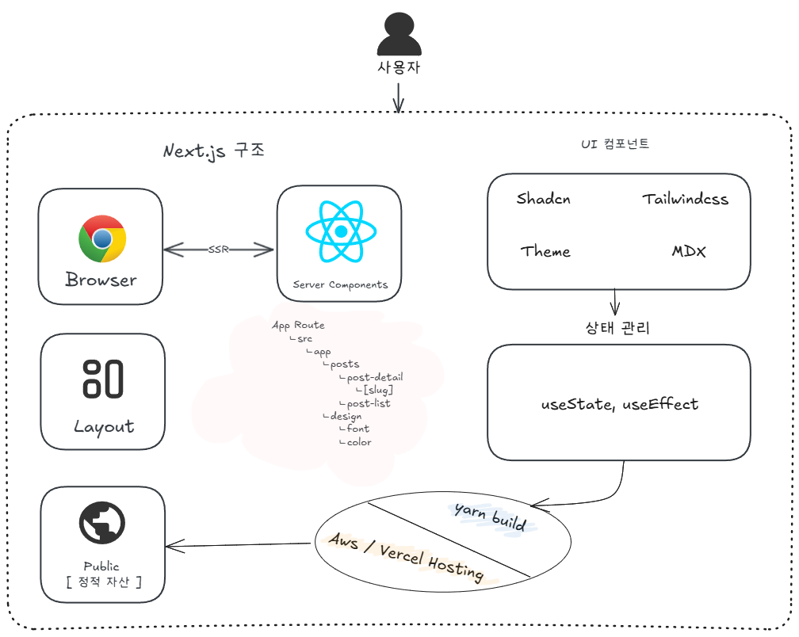

## 시작하며

안녕하세요! 이 블로그의 첫 게시물에 오신 것을 환영합니다. 이 공간은 제가 최신 웹 기술들을 탐구하고 적용하며 만들어가는 과정을 기록하기 위해 만들어졌습니다. 첫 글에서는 이 블로그가 어떤 기술 스택과 구조로 만들어졌는지, 그리고 개발 과정에서 중요하게 생각했던 점들을 공유하고자 합니다.

## 핵심 기술 스택

이 블로그는 다음과 같은 최신 기술들을 기반으로 구축되었습니다.

- **Next.js 15 & React 19**: 서버 컴포넌트(RSC)를 적극 활용하여 성능을 최적화하고, App Router를 통해 라우팅을 관리합니다.
- **MDX**: Markdown에 React 컴포넌트를 통합하여 유연하고 강력한 콘텐츠 작성을 가능하게 합니다. 블로그 게시물은 `/public/posts` 디렉토리에 저장됩니다.
- **Shadcn UI & TailwindCSS 4**: 디자인 시스템과 스타일링을 위해 사용합니다. 모바일 우선 접근 방식을 따르며, 간결하고 재사용 가능한 UI 컴포넌트를 구축합니다.

## 아키텍처 개요

아래 이미지는 이 블로그의 전반적인 아키텍처를 보여줍니다. 사용자의 요청부터 브라우저 렌더링, 서버 컴포넌트 처리, UI 컴포넌트 구성, 그리고 배포까지의 흐름을 나타냅니다.

## 프로젝트 구조

프로젝트는 명확하고 확장 가능한 구조를 지향합니다. 주요 디렉토리 구성은 다음과 같습니다.

| Directory        | Description                                                              |
| :--------------- | :----------------------------------------------------------------------- |
| `src/app`        | Next.js App Router 페이지 및 레이아웃 (예: `/posts/[slug]`, `/design`)   |
| `src/components` | 공유 UI 컴포넌트 (`/mdx`, `/shadcn`, `/theme`, `/ui` 하위 디렉토리 포함) |
| `src/lib`        | 유틸리티 함수, 데이터 로직 등                                            |
| `src/assets`     | 컴포넌트 내에서 사용되는 이미지, 폰트 등 정적 에셋                       |
| `posts`          | MDX 형식 블로그 게시물                                                   |
| `public`         | 정적 파일 제공 (전역 에셋, 이미지 등)                                    |

## 개발 철학 및 팁

개발 과정에서 다음과 같은 원칙과 팁들을 적용했습니다.

1.  **서버 컴포넌트 우선**: 성능 최적화를 위해 가능한 서버 컴포넌트(RSC)를 사용하고 `'use client'` 지시어 사용을 최소화합니다. 클라이언트 측 상호작용이 필요한 경우, 작은 단위의 클라이언트 컴포넌트로 분리하고 `Suspense`로 감싸 로딩 상태를 관리합니다.
2.  **선언적 프로그래밍**: 간결하고 예측 가능한 코드를 위해 함수형 및 선언적 프로그래밍 패턴을 선호합니다.
3.  **상태 관리**: URL 검색 파라미터 상태 관리는 `nuqs` 라이브러리를 활용하여 서버 상태와의 동기화를 유지합니다.
4.  **성능 최적화**:
    - `Suspense` 및 폴백 UI를 사용하여 사용자 경험을 개선합니다.
    - `next/dynamic`을 사용하여 중요하지 않은 컴포넌트를 지연 로딩합니다.
    - `next/image`를 활용하여 WebP 형식 사용, 크기 정보 포함, 지연 로딩 등 이미지 최적화를 수행합니다.
5.  **코드 스타일 및 컨벤션**: 일관성 있는 코드 스타일과 명명 규칙(예: `isLoading`, `hasError` 같은 변수명)을 적용하여 가독성을 높입니다.

## 마치며

이 블로그는 최신 웹 기술을 학습하고 적용하는 여정을 담는 공간이 될 것입니다. 앞으로 Next.js, React, MDX 등 다양한 주제에 대한 글을 꾸준히 올릴 예정이니 많은 관심 부탁드립니다. 첫 게시물을 읽어주셔서 감사합니다!
