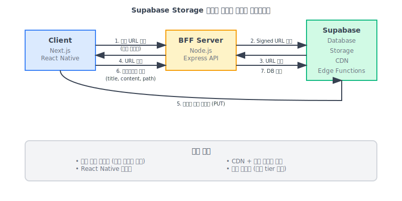

## 문제 상황

블로그 시스템을 구축하면서 다음과 같은 아키텍처 고민이 있었습니다:

- **Next.js** (프론트엔드)
- **Node.js** (BFF - Backend For Frontend, React Native 확장 대비)
- **Supabase** (데이터베이스 + Storage)

특히 이미지 업로드 시 `title`, `content`, `image` 정보를 따로따로 저장하다 보니 서버 부하가 우려되었습니다. 매번 이미지를 Node 서버나 Next.js API를 거쳐 Supabase Storage에 업로드하는 것은 비효율적이었죠.

## 최적화된 파이프라인

### 핵심 아이디어

이미지 파일 자체는 클라이언트에서 Supabase Storage로 **직접 업로드**하고, 서버는 **pre-signed URL 발급**과 **메타데이터 저장**만 담당하는 구조로 설계했습니다.



### 10단계 파이프라인

1. **클라이언트 → BFF(Node)에 확장자 전송해 서명 URL 요청**
2. **BFF가 createSignedUploadUrl로 Supabase Storage URL 발급**
3. **BFF가 `{url, path}`를 클라이언트에 반환**
4. **클라이언트가 서명 URL로 이미지를 Storage에 직접 PUT 업로드**
5. **업로드 완료 후 title‧content‧image_path를 BFF에 POST**
6. **BFF가 blog_posts 테이블에 단일 INSERT로 메타데이터 저장**
7. **조회 시 클라이언트가 CDN URL(+width·quality)로 이미지 요청**
8. **Storage CDN이 리사이즈·캐싱 처리로 응답 속도 최적화**
9. **필요하면 Edge Function이 백그라운드 썸네일·워터마크 작업**
10. **React Native 앱도 동일 BFF 엔드포인트 호출로 재사용 완료**

## 구현 예시

### Node.js BFF 서버

```javascript
// src/routes/signedUrl.js
const express = require("express");
const router = express.Router();
const supabase = require("../supabase");
const { v4: uuid } = require("uuid");

router.post("/", async (req, res) => {
  try {
    const { ext } = req.body; // 예: "jpg"
    const fileName = `${uuid()}.${ext}`; // 충돌 방지

    const { data, error } = await supabase.storage
      .from("blog-images")
      .createSignedUploadUrl(fileName, 60 * 5); // 5분 유효

    if (error) throw error;

    res.json({
      path: fileName,
      url: data.signedUrl,
    });
  } catch (err) {
    res.status(500).json({ message: err.message });
  }
});

module.exports = router;
```

```javascript
// src/routes/posts.js
const express = require("express");
const router = express.Router();
const supabase = require("../supabase");

router.post("/", async (req, res) => {
  const { title, content, image_path, user_id } = req.body;

  try {
    const { error } = await supabase.from("blog_posts").insert({
      title,
      content,
      image_path, // 'blog-images/uuid.jpg'
      author_id: user_id,
    });

    if (error) throw error;
    res.status(201).json({ ok: true });
  } catch (err) {
    res.status(500).json({ message: err.message });
  }
});

module.exports = router;
```

### Next.js 클라이언트

```javascript
// pages/api/uploadImage.js
import axios from "axios";

export default async function handler(req, res) {
  if (req.method !== "POST") return res.status(405).end();

  const { file } = req.body; // Blob or File
  const ext = file.type.split("/")[1];

  // 1) 서명 URL 요청
  const { data: signed } = await axios.post(
    process.env.BFF_URL + "/signed-url",
    { ext }
  );

  // 2) Storage 직접 업로드
  await axios.put(signed.url, file, {
    headers: { "Content-Type": file.type },
  });

  res.json({ path: signed.path });
}
```

## 성능 최적화 포인트

### 1. 이미지 변환 URL

Supabase Storage는 CDN을 통한 즉석 이미지 변환을 지원합니다:

```text
https://<project>.supabase.co/storage/v1/object/public/blog-images/uuid.jpg?width=800&quality=80
```

- CDN 노드에서 리사이즈·압축 후 캐싱
- 원본 파일 접근 없이 전 세계 빠른 응답
- WebP 자동 변환으로 대역폭 절약

### 2. 메타데이터 단일 트랜잭션

기존의 분산된 저장 방식 대신:

```sql
-- ❌ 기존: 여러 번의 INSERT
INSERT INTO posts (title, content) VALUES (...);
INSERT INTO images (post_id, url) VALUES (...);
INSERT INTO tags (post_id, tag) VALUES (...);

-- ✅ 최적화: 단일 INSERT
INSERT INTO blog_posts (title, content, image_path, tags)
VALUES ('제목', '내용', 'blog-images/uuid.jpg', ARRAY['tag1', 'tag2']);
```

### 3. Background Task 처리

썸네일 생성이나 워터마크 처리는 Supabase Edge Function으로 백그라운드 처리:

```javascript
// edge-functions/image-processor.js
import { serve } from "https://deno.land/std@0.168.0/http/server.ts";

serve(async (req) => {
  const { image_path } = await req.json();

  // 썸네일 생성, 워터마크 추가 등
  // 비동기로 처리하여 사용자 응답 지연 없음

  return new Response("Processing started", { status: 200 });
});
```

## React Native 확장성

동일한 BFF API를 사용하여 React Native에서도 쉽게 적용 가능합니다:

```javascript
// React Native
import { launchImageLibrary } from "react-native-image-picker";

const uploadImage = async () => {
  const result = await launchImageLibrary({ mediaType: "photo" });
  const file = result.assets[0];

  // 1) 서명 URL 요청
  const signedResponse = await fetch(`${BFF_URL}/signed-url`, {
    method: "POST",
    headers: { "Content-Type": "application/json" },
    body: JSON.stringify({ ext: file.type.split("/")[1] }),
  });
  const { signedUrl, path } = await signedResponse.json();

  // 2) Storage 직접 업로드
  await fetch(signedUrl, {
    method: "PUT",
    body: file.uri,
    headers: { "Content-Type": file.type },
  });

  // 3) 메타데이터 저장
  await fetch(`${BFF_URL}/posts`, {
    method: "POST",
    headers: { "Content-Type": "application/json" },
    body: JSON.stringify({ title, content, image_path: path }),
  });
};
```

## 보안 및 권한 관리

### RLS (Row Level Security) 설정

```sql
-- blog_posts 테이블 정책
CREATE POLICY "사용자는 자신의 게시글만 생성 가능"
  ON blog_posts FOR INSERT
  WITH CHECK (author_id = auth.uid());

CREATE POLICY "모든 사용자는 게시글 조회 가능"
  ON blog_posts FOR SELECT
  TO public
  USING (true);
```

### Storage 버킷 정책

```sql
-- Storage 버킷 정책
CREATE POLICY "인증된 사용자만 업로드 가능"
  ON storage.objects FOR INSERT
  WITH CHECK (bucket_id = 'blog-images' AND auth.role() = 'authenticated');

CREATE POLICY "모든 사용자는 이미지 조회 가능"
  ON storage.objects FOR SELECT
  USING (bucket_id = 'blog-images');
```

## 성능 모니터링

주요 메트릭을 통해 성능을 지속적으로 모니터링합니다:

| 메트릭           | 목표        | 모니터링 방법      |
| ---------------- | ----------- | ------------------ |
| 업로드 응답 시간 | < 2초       | BFF API 로그       |
| CDN 캐시 히트율  | > 90%       | Supabase Dashboard |
| 이미지 변환 응답 | < 500ms     | Web Vitals LCP     |
| Storage 용량     | 월 1GB 이하 | 사용량 알림        |

## 마무리

이 아키텍처의 핵심 장점은:

1. **서버 부하 최소화**: 파일 업로드 트래픽을 서버가 처리하지 않음
2. **확장성**: React Native 등 다른 클라이언트도 동일 API 사용
3. **성능**: CDN + 즉석 이미지 변환으로 빠른 응답
4. **비용 효율성**: Supabase의 무료 tier 최대 활용

미래에 트래픽이 증가하면 버킷 분리, Edge Function 최적화, CDN 설정 튜닝 등을 단계적으로 적용할 수 있는 확장 가능한 구조입니다.

이미지 업로드 최적화로 더 나은 사용자 경험과 서버 효율성을 동시에 얻을 수 있었습니다. 비슷한 고민을 하고 계신 분들에게 도움이 되길 바랍니다!
